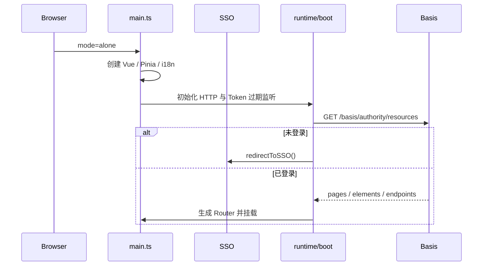
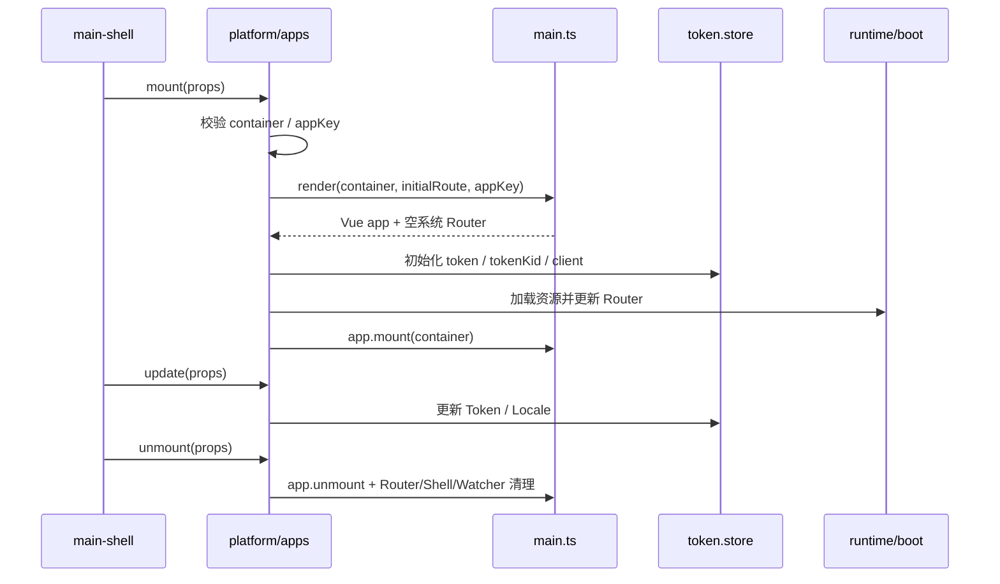

# 运行时流程

## 模式判断

- URL `?mode=alone` 优先，其次读取 `VITE_RUN_MODE=alone`。
- 只有 `alone` 被视为独立运行；空值或其他值都是集成意图。
- 集成意图但未处于 qiankun 时，直链会被包装为 main-shell 网关地址并执行 `location.replace`。

## 独立运行

SSO 回调路径会先使用系统路由挂载回调组件，完成资源初始化后再跳回保存的 return URL。

## qiankun 集成运行

`appKey` 是同 entry 多 Tab 隔离键，不可用应用编码代替。`unmount` 必须配对清理 Router、Shell 和 Token 过期监听引用。

## 资源与路由

1. `resourceManager` 调用 `/basis/authority/resources`。
2. 页面资源通过 `linkPath` 在 `views/route-map.ts` 查找静态组件。
3. 找不到静态映射时，代码会尝试构造动态组件路径；Vite 对任意运行时路径的打包能力有限，因此正式页面应注册到 route-map。
4. 页面元素资源注册到 permission provider，用于 `v-permission`。
5. `hasApiPermission` 当前直接返回 true；不能把 API 前端判断当作后端授权。

## 国际化

- `VITE_I18N_TAGS` 以逗号分隔，公共 Tag 在前、应用 Tag 在后。
- 独立模式由本地 locale Store 管理并持久化选择。
- 集成模式使用 main-shell 的 `locale` props，mount/update 时加载对应文案。
- HTTP 请求通过平台 locale 能力附加 `Accept-Language`。
